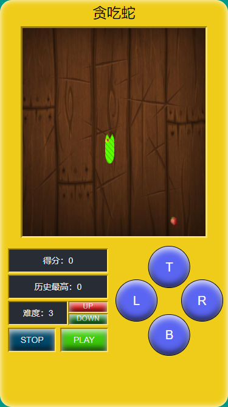

# 贪吃蛇 🐍

##### 🚀 特意写了一个算法还算复杂的贪吃蛇，来检验我在力扣刷了 700 多题算法的水平。

---



该项目重点在于如何实现一个高性能的贪吃蛇而不在 UI 界面上。该项目使用二维数组进行实现，每一步操作的平均时间复杂度为 O(1) 、空间复杂度为 O(n²)，其中 n 是二维数组的边长。

---

#### 实现思路

使用数组进行索引的存储，每一个索引就是一个空间，如下是一个 3 * 3 的矩阵数组：

```
[
  [0, 1, 2],
  [3, 4, 5],
  [6, 7, 8]
]
```

食物会在数组中随机生成，那么每一步操作我们只需检测蛇头位置的索引是否与食物位置的索引相对应即可。

边界检测：如果超出数组范围或蛇头的位置与某段蛇身的位置相对应，说明越界。

###### 地图

原计划是使用二维数组进行单元格的存储，但是二维数组在操作上不如一维数组，所以地图使用的是一维数组转二维数组。

```typescript
// 通过以下计算得到当前索引位 idx 的坐标，gridLength 是二维数组的边长
const i = Math.floor(idx / gridLength)
const j = idx % gridLength
```

###### 蛇

采用双向链表数据结构，每一段都存储当前索引位，在每一步操作时不需要遍历把每段蛇身移动前一段的位置，<strong>只需把倒数第二段蛇尾移到蛇头的位置，蛇尾移动倒数第二段蛇尾的位置，蛇头移动新的位置即可</strong>。

###### 食物

食物需要随机出现，因此必定需要使用随机函数 Math.random() 。

第一种方案比较简单，直接调用随机函数，看看得出的结果是否合法（如果当前索引位被占用则不合法），但随着游戏的进行，数组内的索引位也会越来越少，那么得出不合法的概率将会逐渐增大，因此该算法不稳定。

第二种方案是洗牌算法改良版，原始洗牌算法如下：

```typescript
// 随机抽取 0 - 3 个数，每次抽取的数字都不能相同。
let len = 4 // 当前还剩多少个数
const arr = new Array(len).fill(0).map((_, i) => i)

for(let i = 0; i < arr.length; ++i) {
  const random = Math.floor(Math.random() * len) // 得出范围内的随机索引
  const res = arr[random] // 抽走的数
  arr[random] = arr[len - 1] // 把最后一个索引位的数补到被抽走的位置
  len-- // 抽走一个数
}

/**
 * 上述过程如下：
 * 
 * 生成长度为 4 的数组: [0, 1, 2, 3]
 * 生成随机数 2，那么抽走索引为 2 的值，把当前剩余长度的最后一个索引位的值补到索引位 2 上：
 * [0, 1, 3, 3]
 * 
 * 以此类推直到所有数被抽走
 */
```

由于蛇在移动时会有两种情况：一种是蛇吃到食物，那么蛇尾保留在原来的位置，蛇头前进一格，这相当于洗牌算法中的抽牌；一种情况是蛇未吃到食物，那么蛇头蛇尾都前进一格，这相当于抽一张牌，并且放回一张牌；因此需要在洗牌算法的基础上增加一个放回操作，具体实现请看源码中 ./src/core/Game.ts 的 _updateGrid() 方法。

---